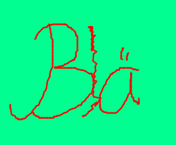

# Fach XY, Stunde 01, 2020-10-29
Protkollantin: Anna Arm
## Bla
Die Grundelement von Markdown sind
* Überschriften unterschiedlicher Ordnung
* Listen
* Tabellen

Es können Bilddateien eingebunden werden.
Für Formeln gibt es einen Umweg über Dienste im Web, die Rastergrafiken aus Urls rendern.
### Beispiel
#### Code
```

```
#### Gerendertes Bild


## Blubber
Es gibt unterschiedliche Arten von Blubber
* gelben Blubber
* grünen blubber
* blauen blubber

## Blä


| Anzahl | Art |
|---|---|
| 3 | Bläblä blä |
| 2 | Bläblä |
| 1 | Blä |
